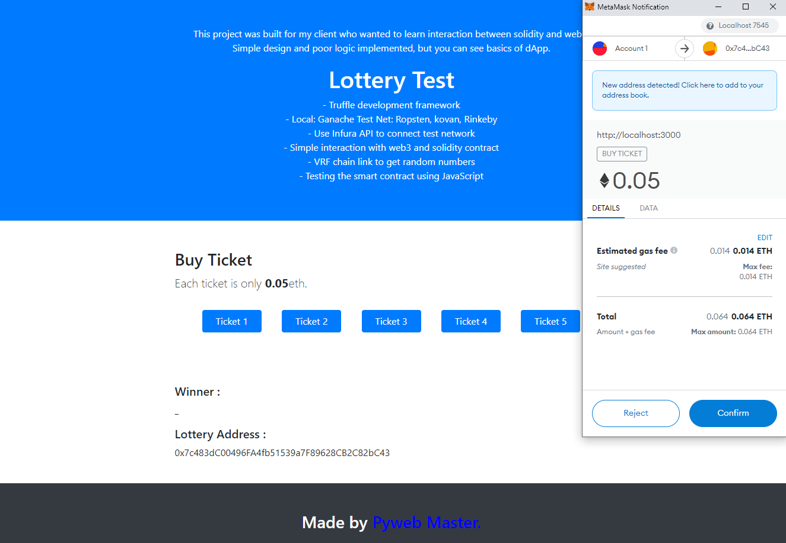

# BASIC TICKET LOTTERY

Ticket Lottery shows interactions between web3 and smart contract.

Built for you to learn basic tutorial.



## References
[Truffle Suite](https://trufflesuite.com/tutorial)
[Web3JS](https://web3js.readthedocs.io/en/v1.2.11/)
[MetaMask](https://docs.metamask.io/guide/#account-management)
[Infura](https://infura.io/docs/ethereum)
## Prepare
### Install Truffle
```bash
npm install -g truffle
```
Install Ganache for local test environment
### Get Infura Connection
Login to [infura.io](https://infura.io).
Create project and get url https://<NETWORK>.infura.io/v3/<PROJECT-ID>
### Generate MNEMONIC
Make .secret file on root directory and save your mnemonic(12 words).
## Installation
Use the package manager [npm](https://docs.npmjs.com/) to install.
```bash
npm install
```
### Compile
```bash
truffle compile
```
### For Test
```bash
truffle test
```
### Migrate
```bash
truffle migrate
```
truffle migrate or truffle migrate --network ropsten or truffle migrate --network kovan
## Launch 
```bash
npm run dev
```
then you can see website on your browser.
